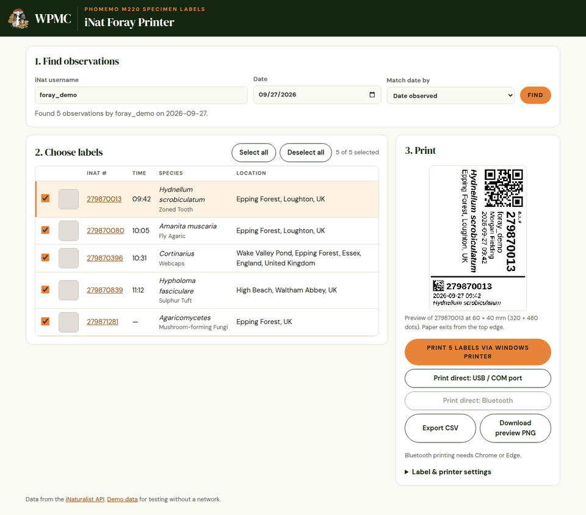
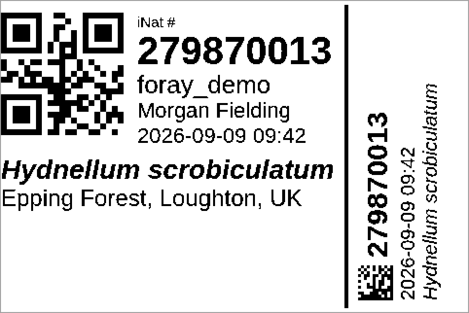

<p align="center">
  <a href="https://wpamushroomclub.org"></a>
</p>

# iNat Foray Printer

A single web page from the **Western Pennsylvania Mushroom Club** that finds all
of an iNaturalist user's observations for one day, lets you tick which ones you
want, and prints a specimen label for each on a **Phomemo M220** (60 × 40 mm /
2.36″ × 1.57″ labels by default).

There is no install and no build step. It is plain HTML and JavaScript.

<h3 align="center">
  ⬇️ <a href="https://github.com/wpamushroomclub/iNat-foray-printer/releases/latest">Download the latest release</a>
</h3>
<p align="center">
  Download the <code>.zip</code> from the release, unzip it, and open <code>index.html</code> in Chrome or Edge.
</p>



## Label layout

This is the demo label exactly as the page draws it (480 × 320 dots, shown at
2×, with the default 1.5 mm shift left and no rotation; the paper output
direction is up). The observer is a demo
account and the iNat number is made up.



* **The QR code** holds just the iNat number, for example `279870013`.
* **The side strip is cut off along the divider line and kept with the
  physical voucher.** It stands alone: a Data Matrix code of just the iNat
  number with the number printed beside it, then the date and time, then the
  species. The code sits about 1.25 mm from the line, so a slightly off cut
  does not clip it. It is a 2D code rather than a 1D barcode because 1D bars
  only 2 dots wide merge when printed; Data Matrix squares are 3 dots and
  error-corrected. The strip is 24% of the label width, 14.4 mm on
  a 60 mm label, and its text stays 2 mm clear of the label edge, which the
  printer cannot reach.
* The observer's real name from their iNat profile is printed under the
  username, when they have set one.
* Scientific names at genus rank and below are printed in italics.
* The date and time are the observation's local time.
* The location is iNaturalist's place name (`place_guess`), wrapped and sized
  to fit.
* When scanned, both codes type just the iNat number, so a scanner used as a
  keyboard fills one spreadsheet cell. The CSV export's `qr_code` column holds
  the same number.

## Using it

1. Open `index.html` in **Chrome or Edge**, either from disk or hosted (for
   example on GitHub Pages).
2. Enter an iNat username and a date, then choose **Find**. You can match by
   the date observed (the default) or the date uploaded.
   **Fungi, lichens & slime molds only** (ticked by default) hides plants,
   animals and other life. Observations with no ID yet, or one too broad to
   tell (such as *Life* or *Protozoa*), are still shown. Untick it to see
   everything.
3. All results start selected. Use **Select all**, **Deselect all**, or the
   checkboxes. Click a row to preview its label.
4. Print using one of the methods below.

To try the page without a network connection or a real account, open
`index.html?demo=1`.

## Printing methods

| Button | What it needs | How it works |
|---|---|---|
| **Print via Windows printer** | The M220 Windows driver ([phomemo.com/pages/drivers](https://phomemo.com/pages/drivers/)) | Opens the browser print dialog with one 60 × 40 mm page per label |
| **Print direct: USB / COM port** | Chrome or Edge on a computer; no driver | Sends printer commands over the USB virtual COM port, or over a paired Bluetooth serial COM port (Web Serial) |
| **Print direct: Bluetooth** | Chrome or Edge with Bluetooth; no driver | Sends printer commands over Bluetooth LE (Web Bluetooth) |
| **Export CSV** | Nothing | Fallback: a spreadsheet to import into Labelife, including a `qr_code` column |

### Windows printer: first-time setup

In the print dialog:

* **Destination:** Phomemo M220
* **More settings → Paper size:** 60 × 40 mm. If that size isn't listed, add
  it in the driver's *Printing preferences* as 60 × 40 mm, portrait. The page
  asks Chrome for portrait: a landscape job makes the M220 driver turn the
  label 90°, even though the print preview looks right.
* **Use Chrome or Edge.** Firefox shows portrait in its print preview but
  still sends a landscape job, so the label prints turned 90°. The page
  shows a warning in browsers other than Chrome and Edge.
* **Margins:** None
* **Scale:** Default (100%)

Chrome remembers these settings for next time.

### Direct printing: calibration

Direct printing sends the label as a 480 × 320 dot image (8 dots = 1 mm),
or 320 × 480 when it is rotated 90°.
Open **Label & printer settings** to adjust:

* **Density** (1–15): how dark the print is. Raise it if the print is faint.
* **Speed** (1–5).
* **Media:** labels with gaps (default), continuous roll, or black-mark labels.
* **Left offset:** shifts the image right if the print sits too far left on
  the label.
* **Shift left** (mm, default 1.5): moves the whole label towards the QR
  code, for every printing method. The printer does not reach the far edge
  of the side strip, so without it the strip's last line (the species) can
  be cut off. Raise it if that line is still clipped; lower it if the QR code
  is. The preview shows the result.
* **Rotation:** turns the printed image to match how the label feeds.
  The default is 90° clockwise, which prints correctly on the M220 through
  the Windows driver in Chrome; the other options are none,
  90° counter-clockwise and 180°. This applies to every printing method and
  the preview.

Settings are saved in the browser.

## Files

| Path | Purpose |
|---|---|
| `index.html`, `css/app.css` | Page, styled to match the WPMC website |
| `js/inat.js` | iNaturalist API search, with paging and time-zone handling |
| `js/label.js` | Draws a label (QR code, Data Matrix, text) onto a 1-bit canvas at 203 dpi |
| `js/datamatrix.js` | Minimal Data Matrix (ECC 200) encoder for the iNat number |
| `js/phomemo.js` | M110/M120/M220 printer protocol, plus the Web Serial and Web Bluetooth connections |
| `js/app.js` | Selection, preview, printing and CSV export |
| `img/wpmc-mark.png`, `fonts/` | WPMC logo, and the club website's DM Sans and DM Serif Display fonts (SIL OFL 1.1) |
| `CHANGELOG.md` | Release history |
| `package.json`, `scripts/`, `.github/workflows/release.yml` | Versioning and release automation (see Releasing) |
| `LICENSE`, `THIRD-PARTY-NOTICES.md` | MIT License, and the licenses of the bundled QR library and fonts |
| `docs/` | README images: club logo, page screenshot and example label |
| `vendor/qrcode.js` | [qrcode-generator](https://github.com/kazuhikoarase/qrcode-generator) 1.4.4 (MIT) |

The printer protocol comes from the reverse-engineering work in
[vivier/phomemo-tools](https://github.com/vivier/phomemo-tools).

## Releasing

The version lives in one place, `package.json`. Everything else is
generated from it. You need Node.js to make a release, but not to use the
page.

1. As you work, note user-visible changes under `## [Unreleased]` in
   `CHANGELOG.md`.
2. On a clean `main`, run one of:

   ```sh
   npm version patch   # 1.0.0 -> 1.0.1: fixes
   npm version minor   # 1.0.0 -> 1.1.0: new features
   npm version major   # 1.0.0 -> 2.0.0: changes that break existing use
   ```

   This updates the version in `package.json` and the page footer, moves
   the Unreleased notes into a dated section for the new version, then
   commits and tags (`v1.1.0`).
3. `git push --follow-tags`

Pushing the tag runs the **Release** GitHub Action. It checks that the tag,
`package.json`, the page footer and the changelog all agree. Then it builds
`iNat-foray-printer-v<version>.zip` and publishes the GitHub release, using
that version's changelog section as the release notes.

| Command | What it does |
|---|---|
| `npm run check-version` | Fails if any file shows a different version from `package.json` |
| `npm run build` | Builds the download zip and release notes into `dist/` from the last commit |

Development files (`package.json`, `scripts/`, `.github/`) are left out of
the download; see `.gitattributes`. To add another place that shows the
version, add it to the `targets` list in `scripts/version.mjs`.

## License

[MIT License](LICENSE), © 2026 Western Pennsylvania Mushroom Club. Bundled
third-party components (the QR code library and the DM fonts) keep their own
licenses; see [THIRD-PARTY-NOTICES.md](THIRD-PARTY-NOTICES.md).
